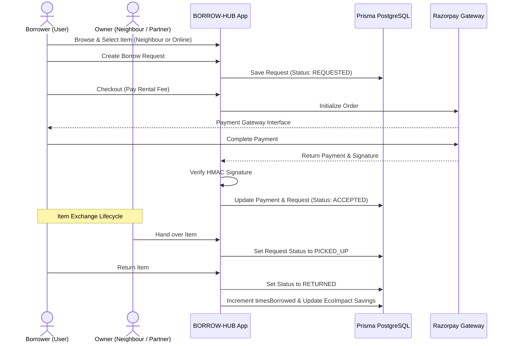

# BORROW-HUB
### Peer-to-peer and business-to-consumer community sharing and rental platform

Next.js 16 | Prisma ORM | PostgreSQL | TailwindCSS | NextAuth.js | Razorpay | OpenAI Vision | MIT License

---

## One-Line Value Proposition
BORROW-HUB is a community-driven, secure sharing economy SaaS platform that turns idle household tools, equipment, and electronics into shared utility — enabling neighbors and businesses to list, discover, rent, and verify items locally.

---

## The Problem
The financial and environmental cost of ownership for underutilized items (lawnmowers, power tools, camping gear, high-end cameras, party supplies) is high. Individuals buy expensive equipment they only use once a year, while local commercial rental businesses lack a unified, modern interface to publish and manage their fleet.

Existing peer-to-peer marketplaces suffer from:
1. **Lack of Trust & Safety**: No verification of item quality, condition, or user identity.
2. **Painful Coordination**: Manual listings, static directories, and back-and-forth messages about item availability.
3. **Financial Risk**: No secure deposit collection, payment processing, or late return penalty enforcement.
4. **Environmental Toll**: Unchecked consumerism leading to manufacturing waste and high carbon footprint from one-off purchases.

---

## The Product
BORROW-HUB bridges this gap with an all-in-one sharing portal. Users can toggle between two primary rental streams:
- **NEIGHBOUR**: Geolocation-based peer-to-peer sharing, sorted by proximity, running on a collaborative checkin/checkout lifecycle.
- **ONLINE**: Instant booking from verified commercial inventory hubs with automated approval pipelines.

Key Features:
- 👁️ **AI-Powered Item Listing**: Upload a photo, and OpenAI's Vision model (`gpt-4o-mini`) automatically identifies the item, writes a descriptive paragraph, tags categories, and calculates recommended rental pricing and security deposits.
- 💳 **Integrated Razorpay Payments**: Secure payment escrow for rental charges. Verification protocols ensure payments are authorized, signed, and updated before rental requests are accepted.
- 💼 **Partner Portal**: Users can submit KYC applications (bank account details, Aadhaar, PAN, Shop License uploads) to transition into commercial Partners. Unlocks fleet management, earning dashboards, and rental analytics.
- 🗺️ **Geo-Location & Proximity Search**: Active Leaflet maps map out listed items, enabling neighbors to filter items within custom search radii.
- 🌱 **Ecological Impact Dashboard**: Calculates cumulative environmental statistics including CO2 saved (kg), waste prevented (kg), and money saved (INR) by choosing to borrow rather than buy.
- 🛡️ **Admin & Audit Logging**: Centralized dashboard for platform administrators to approve business verifications, resolve user reports, and view detailed audit trails.

---

## Target Audience
BORROW-HUB is designed to build localized sharing ecosystems for:
* **Local Neighbors**: Individuals looking to save money by borrowing tools or monetize their idle goods.
* **Commercial Partners**: Small businesses, tool-rental shops, and event vendors who want a digital storefront to manage their listings.
* **Platform Administrators**: Super-users responsible for KYC verification, review moderation, and platform security.

---

## Core Workflows



1. **Become a Partner**: Submit business details -> Admin reviews and approves KYC -> Partner profile activated.
2. **List an Item (AI Assisted)**: Drag & drop product photos -> OpenAI Vision autofills name, condition, suggested rates, deposit, and descriptions -> Customize policies -> Item goes live.
3. **Search & Book**: Proximity-based item catalog -> Filter by search radius -> View details -> Request to borrow.
4. **Verification & Checkout**: Secure Razorpay integration creates orders in INR -> Verifies payment completion via cryptography signature -> Transitions booking status.
5. **Rental Lifecycle Execution**: `REQUESTED` ➔ `ACCEPTED` ➔ `PICKED_UP` ➔ `RETURNED`. On return, usage metrics update the Global Eco Impact ledger.

---

## How the Agent System Works (System Architecture)

| Component | Responsibility | Tech Details |
| :--- | :--- | :--- |
| **Prisma Data Layer** | Models schema, manages relations, indexes geolocation, and enforces onDelete Cascade constraints. | PostgreSQL, Prisma Client |
| **AI Vision Layer** | Reads base64 images to detect object details, suggest pricing, and evaluate item condition. | OpenAI API (`gpt-4o-mini`) |
| **Payment Gateway** | Handles billing, order generation, and secure callback webhooks. | Razorpay Node SDK, Crypto HMAC |
| **Authentication** | Controls session states, user logins, credential security, and permission groups. | NextAuth.js, Bcrypt.js, JWT |
| **Map & Location** | Calculates distances between users/items and renders spatial items. | Leaflet, React Leaflet Cluster |
| **Audit Logging** | Monitors user logins, modifications, admin actions, IP addresses, and device signatures. | Audit Log Engine |

---

## Project Structure

```
BORROW-HUB/
├── app/                  # Next.js 16 App Router pages
│   ├── activity/        # User borrowing history
│   ├── admin/           # Admin verification & auditing panel
│   ├── analytics/       # Partner business metrics
│   ├── api/             # REST API endpoints (Auth, Items, Payments, Requests)
│   ├── browse/          # Proximity search and item catalog
│   ├── dashboard/       # User profile center
│   ├── inventory/       # Partner inventory management
│   ├── partner/         # Business application and onboarding
│   └── requests/        # Incoming/Outgoing borrow requests
├── components/          # Reusable UI elements (Leaflet Maps, Forms, Layouts)
├── lib/                 # Shared utilities, Prisma clients, and services
│   ├── services/        # AI Vision, Cloudinary, and Payment helper modules
│   └── auditLogger.ts   # System activity auditing logs
└── prisma/              # DB Schema and Seed files
    ├── schema.prisma    # PostgreSQL Schema
    └── seed.js          # Default database seed data
```

---

## Local Setup & Run instructions

For complete terminal execution details, please see **[running.md](file:///c:/Users/rocky/BORROW-HUB/running.md)**.

### Quick Start:
```bash
# 1. Install dependencies
npm install

# 2. Setup your .env file in the root directory (see running.md for template)

# 3. Synchronize database
npx prisma generate
npx prisma migrate dev --name init
npx prisma db seed

# 4. Start local development server
npm run dev
```

---

## Environment Variables

| Variable | Required | Description |
| :--- | :--- | :--- |
| `DATABASE_URL` | **Yes** | Direct connection string to your PostgreSQL instance. |
| `DIRECT_URL` | **Yes** | Direct database connection string (used by Prisma for migrations). |
| `NEXTAUTH_SECRET` | **Yes** | Custom 32-character key to encrypt session tokens. |
| `NEXTAUTH_URL` | **Yes** | Base application URL (default: `http://localhost:3000`). |
| `OPENAI_API_KEY` | No | OpenAI credentials (used to run the AI Vision listing generator). |
| `CLOUDINARY_CLOUD_NAME` | No | Cloudinary cloud account name (used for user image hosting). |
| `CLOUDINARY_API_KEY` | No | Cloudinary API Key. |
| `CLOUDINARY_UPLOAD_PRESET` | No | Cloudinary preset folder configuration (default: `borrow_hub_preset`). |
| `RAZORPAY_KEY_ID` | No | Razorpay checkout public Key. |
| `RAZORPAY_KEY_SECRET` | No | Razorpay private secret key (for verifying cryptographic callback signature). |

---

## Running Tests

BORROW-HUB includes automated test suites to ensure compliance with database schema rules and API isolation.

```bash
# Run schema cascade, auth, and business rule tests offline
node test-backend-full.js

# Run live endpoint verification tests (requires server running in another tab)
node test-backend.js
```

---

## Product Roadmap

* **Phase 1: Foundation (Current)**: Geolocation mapping, NextAuth credential sessions, Razorpay integration, database schemas, and admin verification panels.
* **Phase 2: Mobile App / PWA**: Optimize layouts for mobile devices and add push notifications for incoming rental requests.
* **Phase 3: Security & Insurance**: Add security deposit holds and peer-to-peer insurance coverage protocols for premium items.
* **Phase 4: Advanced Fleet Analytics**: Unlocking automated pricing models for partners based on local demand index.

---

## License & Origin
Licensed under the **MIT License**. Created as a SaaS solution for local community resource sharing.
